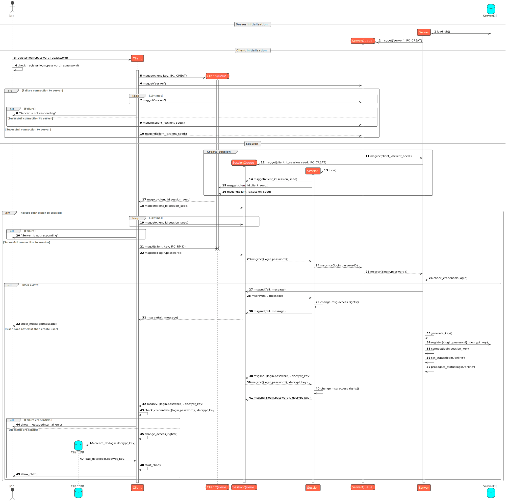
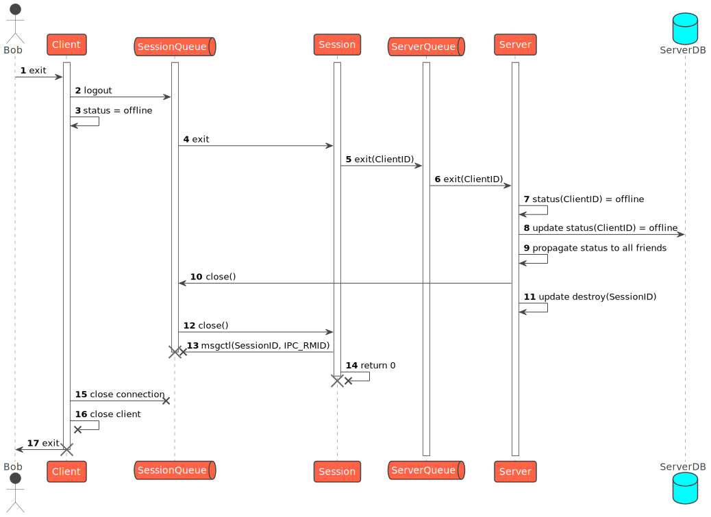
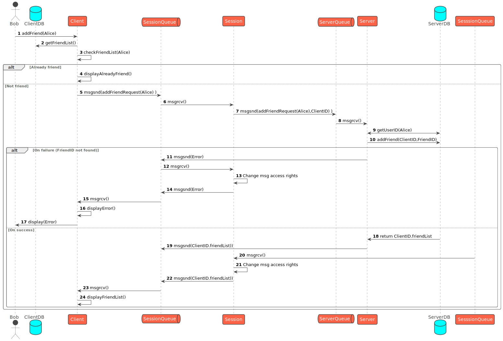
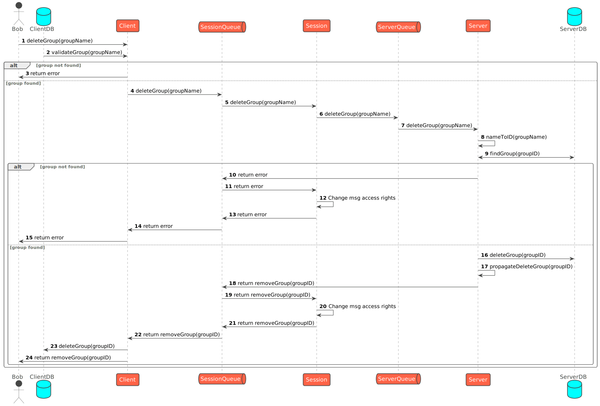

# PROTOCOL Description

## 1. Introduction

In this section we describe protocols used in our application. We use [PlantUML](http://plantuml.com/) to describe protocols. You can find source files in `./puml` directory.

Our app is a client-server application. Where server is a central server and client is a user's device. Server creates a new subprocess (session) for each client connection.

Goal is to provide secure communication between client and server.

## 2. Protocols

For communication between client and server we use IPC (Inter Process Communication). We use `struct Message` to send data between client and server. Message struct is defined in `./src/message.h` file.

### 2.0. Connection

### 2.1. Login

### 2.2. Register

### 2.3. Client
#### 2.3.1. Load

#### 2.3.2. Exit

### 2.5. Friends
#### 2.5.1. Add Friend

#### 2.5.2. Remove Friend

### 2.6. Groups
#### 2.6.1. Create Group

#### 2.6.2. Add user to Group

#### 2.6.3. Remove user from Group

#### 2.6.4. Delete Group

### 2.7. Messages

#### 2.7.1. Send Message to Friend

#### 2.7.2. Send Message to Group

## 3. Data structures

Data is stored in a `JSON` files.
Server stores data in `serverDB.json` and client stores data in `clientDB_<USER>.json`. Where `<USER>` is the username of the user who logged on this device.

File `clientDB_<USER>.json` is encrypted. Key is stored in `serverDB.json` in `Users[].key` field.

### 3.1 ClientDB

### 3.2 ServerDB
